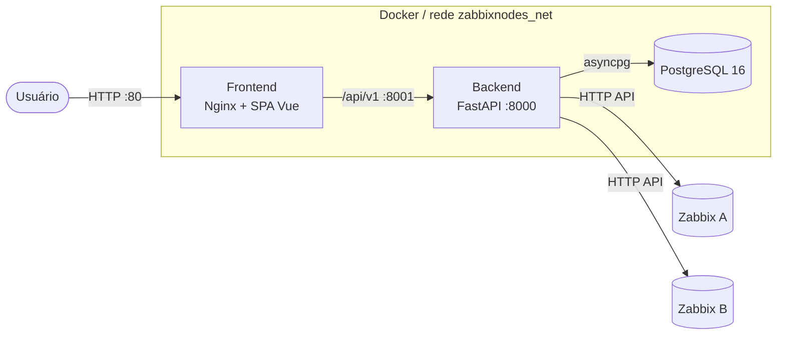
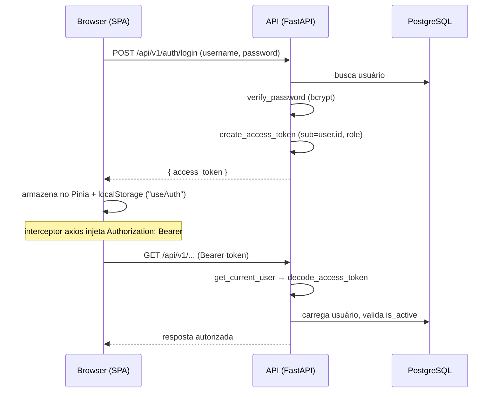

# Arquitetura

O ZabbixNodes é composto por três serviços conteinerizados: **frontend** (SPA Vue servida
por Nginx), **backend** (API FastAPI) e **banco de dados** (PostgreSQL). O backend conversa
com os servidores **Zabbix** gerenciados via API HTTP.

## Visão geral



!!! note "Portas"
    Em produção o backend é exposto em `8001:8000` e o frontend em `80:80`
    (ver `docker-compose.yml`). O Nginx serve a SPA e o navegador chama a API
    diretamente pela `VITE_API_BASE_URL` (ex.: `http://142.93.116.237:8001/api/v1`).

## Componentes

| Serviço | Imagem | Porta | Responsabilidade |
|---------|--------|-------|------------------|
| `frontend` | `registry.lunioit.com/zabbixnodes-frontend:vue-dev` | `80` | Servir a SPA Vue (build estático via Nginx) |
| `api` | `registry.lunioit.com/zabbixnodes-backend:vue-dev` | `8001 → 8000` | API REST, regras de negócio, integração Zabbix |
| `db` | `postgres:16-alpine` | `5432` | Persistência |

## Fluxo de autenticação {#fluxo-de-autenticacao}

A autenticação é baseada em **JWT (HS256)**. O token é emitido no login e enviado em cada
requisição no header `Authorization: Bearer <token>`.



Pontos relevantes (código real):

- **Emissão** — `back-zabbixnodes/api/v1/auth.py` (`POST /auth/login`), via
  `create_access_token({"sub": str(user.id), "role": user.role})` em `core/security.py`.
- **Validade** — controlada por `JWT_EXPIRATION_HOURS` (padrão `8`).
- **Validação** — `back-zabbixnodes/api/deps.py` → `get_current_user` decodifica o token,
  carrega o usuário e exige `is_active`.
- **Autorização** — `require_superadmin` e `check_instance_access` (permissão por instância,
  com `require_write` para operações de escrita).
- **Frontend** — `src/stores/auth.js` (Pinia) guarda `token`, `user`, `role` em
  `localStorage` (chave `useAuth`); `src/composables/useApi.js` injeta o header e, em
  resposta `401`, faz logout e redireciona para `login`.

!!! warning "Credenciais do Zabbix são criptografadas"
    As credenciais/tokens das instâncias Zabbix são cifradas com **AES-256-GCM** antes de
    serem usadas/armazenadas (`core/security.py` → `encrypt_token`). A chave vem de
    `ENCRYPTION_KEY` e precisa ter **32 bytes** (hex ou base64). Veja
    [Variáveis de ambiente](deploy/environment.md).

## Estrutura de pastas

### Backend (`back-zabbixnodes/`)

```text
back-zabbixnodes/
├── main.py              # app FastAPI, middlewares, /health, lifespan
├── entrypoint.sh        # espera o banco, roda migrations, sobe uvicorn
├── wait_for_db.py       # checagem de readiness do banco via asyncpg
├── requirements.txt
├── alembic.ini
├── alembic/             # migrations (versions/)
├── api/
│   ├── deps.py          # dependências de auth/autorização
│   └── v1/
│       ├── router.py    # agrega todos os routers sob /api/v1
│       └── *.py         # auth, instances, hosts, triggers, ...
├── core/
│   ├── config.py        # settings (pydantic-settings)
│   ├── database.py      # engine async + sessionmaker
│   └── security.py      # JWT, bcrypt, AES-256-GCM
├── models/              # modelos SQLAlchemy
├── schemas/             # schemas Pydantic
└── services/            # integração Zabbix, dashboard, reports, ...
```

### Frontend (`front-zabbixnodes/`)

```text
front-zabbixnodes/
├── main.js              # bootstrap Vue + Pinia + Router
├── vite.config.js
├── nginx.conf           # config Nginx (SPA + cache)
├── docker-entrypoint.sh
└── src/
    ├── App.vue
    ├── layout/          # AppLayout.vue
    ├── router/          # rotas + (rota pública /login)
    ├── stores/          # Pinia (auth.js, ...)
    ├── composables/     # useApi.js (cliente axios)
    ├── views/           # telas (ex.: TriggersListView.vue)
    └── components/
```

!!! info "TODO"
    Não há arquivos `CLAUDE.md` no repositório no momento desta documentação. Caso sejam
    adicionados, incluir aqui as convenções específicas de cada serviço.
